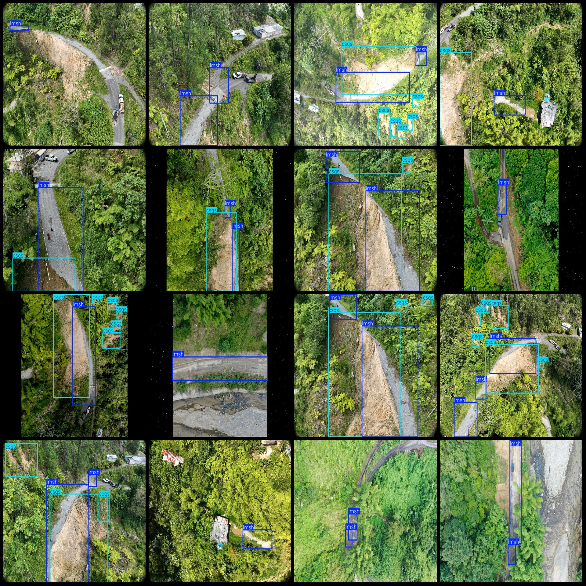
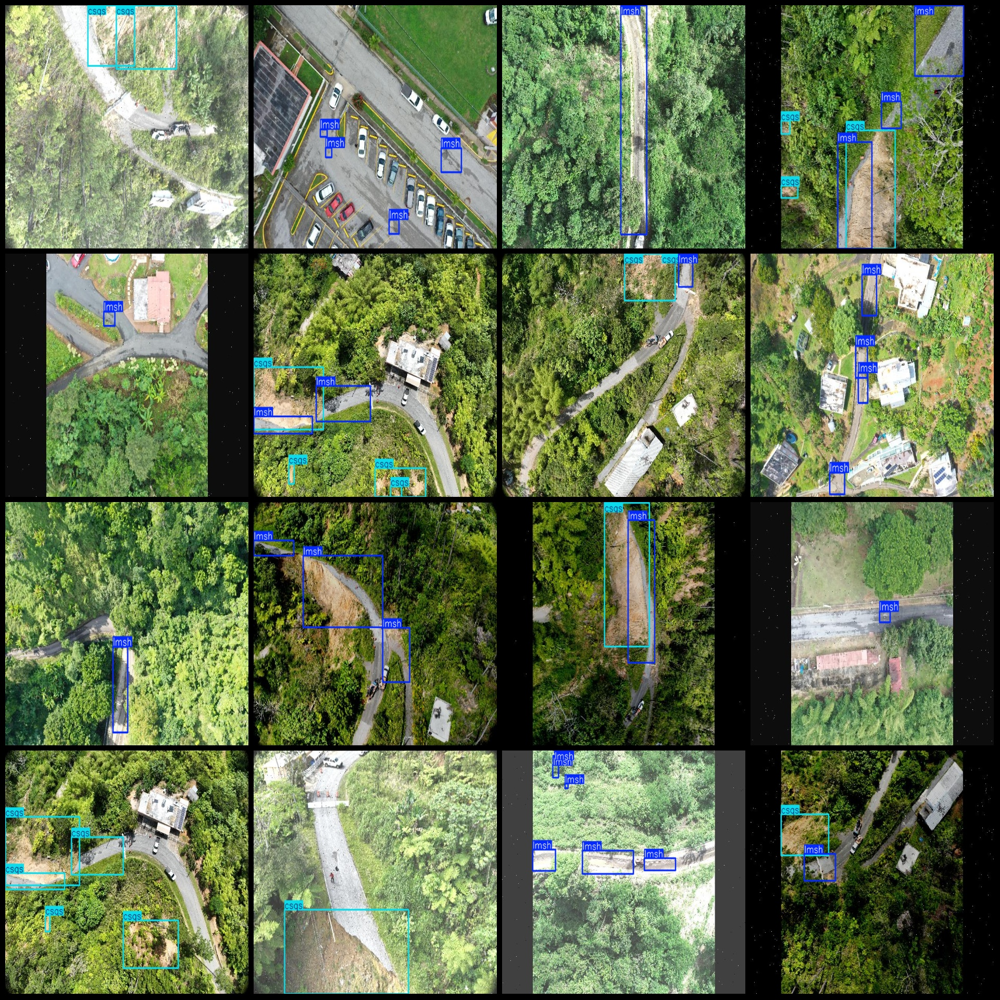

# Drone Perspective Road Damage and Washout Prediction Data Set - VOC+YOLO Format with 579 Images in 4 Categories

Dataset Format: Pascal VOC format + YOLO format (without split path's txt file, only containing jpg images and corresponding VOC format xml files and YOLO format txt files)
Number of Images (jpg file count): 579
Number of Annotations (xml file count): 579
Number of Annotations (txt file count): 579
Number of Annotation Categories: 4
Annotation Category Names (Note that the order of categories in the YOLO format does not match this, but is based on the labels folder "classes.txt"): ["csqs", "lmsh", "sjps", "sszs"]
Number of Boxes per Category:
- csqs (washout erosion) = 533
- lmsh (road damage) = 979
- sjps (road shoulder damage) = 2
- sszs (rock blockage) = 1
Total Boxes: 1515
Number of Images per Category:
- csqs (washout erosion) = 240
- lmsh (road damage) = 528
- sjps (road shoulder damage) = 2
- sszs (rock blockage) = 1
Image Resolution: Multi-resolution images, such as 640x479, 640x426, etc.
Drone: DJI MAVIC 3
Collecting Height: 100m
Collecting Angle: 90°
Using Annotation Tool: labelImg
Annotation Rules: Drawing a square box around each category
Important Notice: The dataset does not have been divided into training, validation, or test sets; you need to do so yourself.
Special Remark: This dataset does not guarantee any accuracy for the trained models or weight files.
Image Preview:
Annotation Example:

## Image

Here is a pay link on Stripe ( https://buy.stripe.com/3cs8yP7sY87d0vu9AB ). Please contact me lonlonago@foxmail.com after funding $89, and I will send you a complete data files , thank you!

